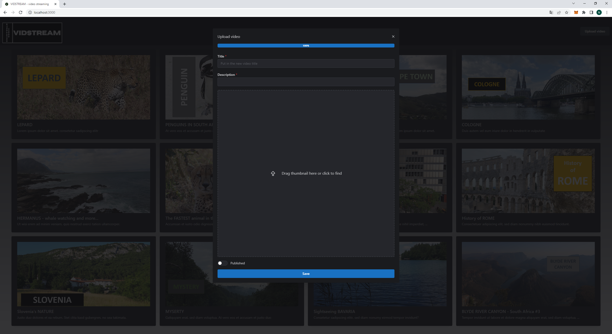
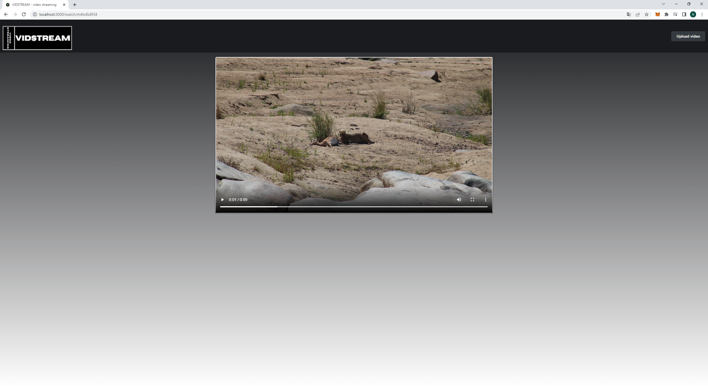

# VIDSTREAM video-streaming-platform

## Features
- Register, Login a user
- Upload videos with thumbnail, title and description
- Show uploaded videos
- Stream a video

## User Interface
### Main Page
- Choose a video to stream

### Upload Video
- Upload videos with thumbnail, title and description

### Stream Video
- Stream a video

## Technologies
### Backend
[Express](https://expressjs.com)
[Node.js](https://nodejs.org)
[MongoDB/mongoose](https://www.mongodb.com/)
[TypeScript](https://www.typescriptlang.org)
[busboy](https://www.npmjs.com/package/busboy)
[zod](https://github.com/colinhacks/zod)

### Frontend
[Next.js](https://nextjs.org)
[MantineUI](https://mantine.dev)
[TypeScript](https://www.typescriptlang.org)
[react-query](https://tanstack.com/query/v3/)
